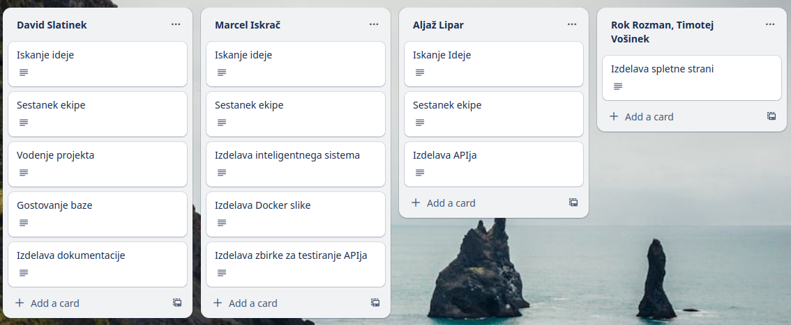

# zx99

Cilj projekta je bil razviti inteligentni sistem za prepoznavanje živali iz slik s pomočjo strojnega učenja.

  
   
  <i>Infrastruktura projekta.</i>

Prispeval:
<table>
    <tbody>
        <tr>
            <td align="center">
                <a href="https://github.com/david-slatinek">
                    
                     
                    <b>David Slatinek</b>
                </a>
            </td>
        </tr>
    </tbody>
</table>

# Model strojnega učenja

Uporabili smo vnaprej pripravljen model strojnega učenja [[1]](#1), katerega smo nato doučili za naš problem. Model
lahko prepozna 9 različnih vrst živali: mačka, pes, koala, surikata, opica, panda, penguin, zajec in tiger. Za
gostovanje modela smo uporabili spletno storitev HuggingFace [[2]](#2).

Prispeval:
<table>
    <tbody>
        <tr>
            <td align="center">
                <a href="https://github.com/iskraM">
                    
                     
                    <b>Marcel Iskrač</b>
                </a>
            </td>
        </tr>
    </tbody>
</table>

# API

API omogoča uporabnikom, da pošljejo sliko živali in prejmejo napoved o njeni vrsti. Za razvoj API-ja smo uporabili
programski jezik Python in knjižnico Flask. Podatki se shranjujo v podatkovno bazo MongoDB, ki gostuje na platformi
MongoDB Atlas. Za gostovanje Docker slike smo uporabili platformo DockerHub.

  
   
  <i>Napovedovanje kategorije živali in zanimivost.</i>

Prispeval:
<table>
    <tbody>
        <tr>
            <td align="center">
                <a href="https://github.com/iskraM">
                    
                     
                    <b>Marcel Iskrač</b>
                </a>
            </td>
            <td align="center">
                <a href="https://github.com/LiparAljaz">
                    
                     
                    <b>Aljaž Lipar</b>
                </a>
            </td>
        </tr>
    </tbody>
</table>

# Spletna stran

Spletna stran je namenjena predstavitvi projekta in omogoča uporabnikom, da preko nje dostopajo do API-ja. Za razvoj smo
uporabili programski jezik JavaScript in knjižnico React.

  
   
  <i>Spletna stran.</i>

Prispeval:
<table>
    <tbody>
        <tr>
            <td align="center">
                <a href="https://github.com/rokrozman321">
                    
                     
                    <b>Rok Rozman</b>
                </a>
            </td>
            <td align="center">
                <a href="https://github.com/VosinekTimotej">
                    
                     
                    <b>Timotej Vošinek</b>
                </a>
            </td>
        </tr>
    </tbody>
</table>

# Razdelitev dela

  
   
  <i>Zadolžitve pri projektu.</i>

# Viri

<a id="1">[1]</a>
https://huggingface.co/microsoft/resnet-50

<a id="2">[2]</a>
https://huggingface.co/devMinty/zx99-animal-classifier
